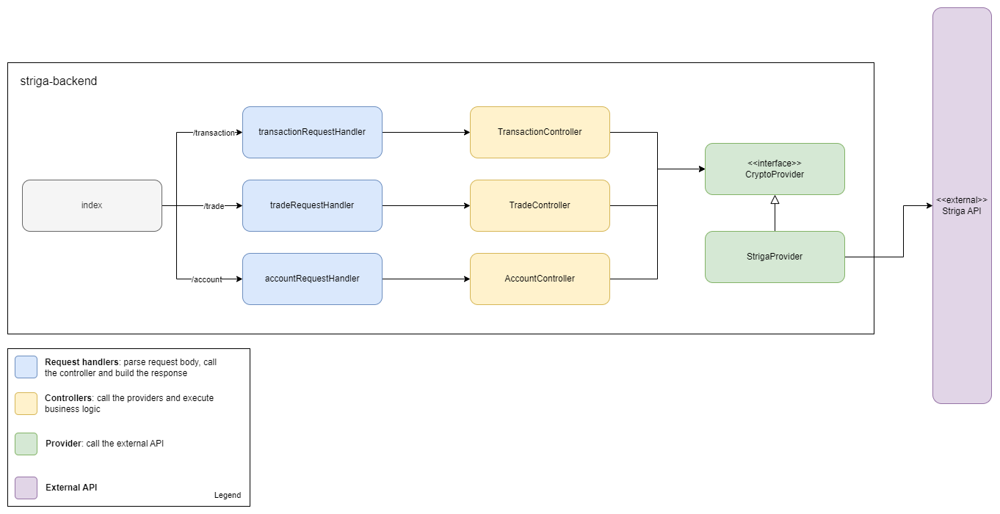

# Striga test backend

## Technologies
I have decided not to use a big framework for this project. Since it's the first time I'm working with a typescript backend, I've decided not to use frameworks like NestJS to get used to the underlying technologies that they use, like Express.

## Project structure

This is how I have organized the different files and classes:

The service is divided in three layers:
* Request handlers: parse request body, calls the controller and build the response
* Controllers: implement business logic calling the providers
* API access/providers: call the external API

For the API providers I have created a factory to abstract the implementation from the rest of the app. This factory currently returns an instance of `StrigaProvider`, but in the future we could migrate to a new provider or use different ones depending on the context.